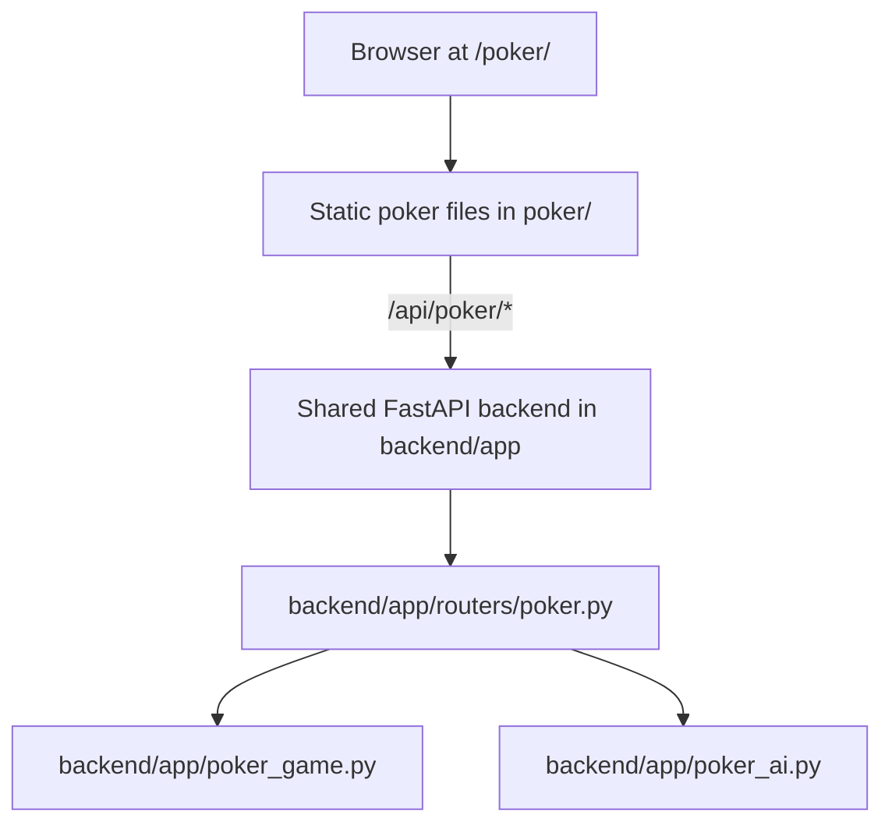
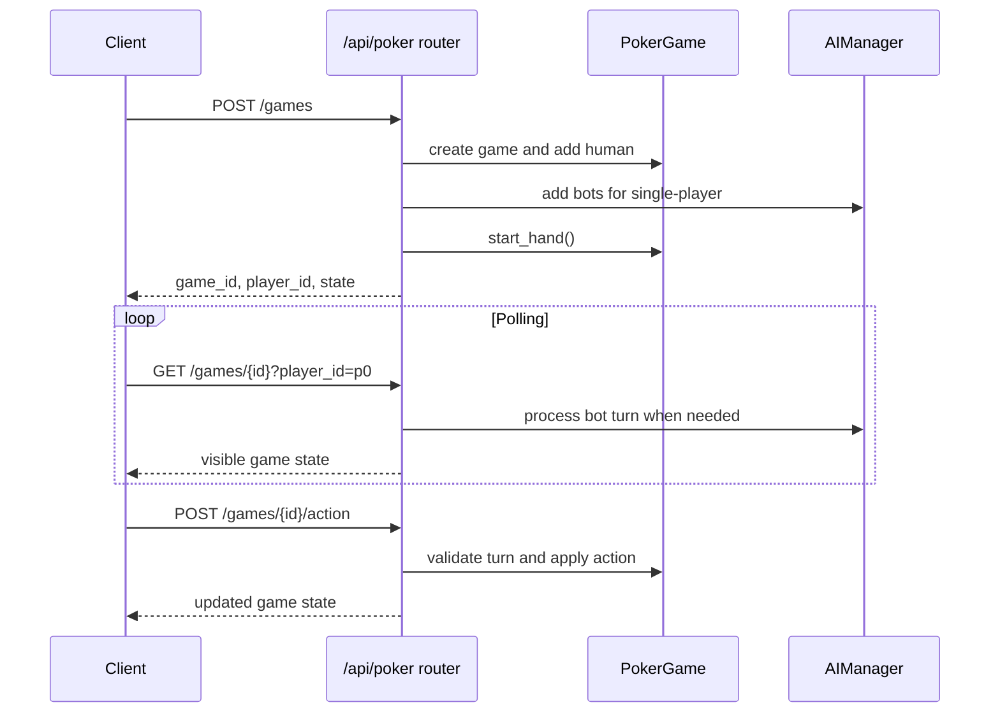

# Poker App Architecture

This document describes the poker app as it is wired in the current root site deployment.

**Last Updated:** May 27, 2026

## Active Runtime



Production Vercel serves the static frontend and rewrites `/api/*` to the Railway backend. Railway is built from the root `Dockerfile`, which copies `backend/` and runs `uvicorn app.main:app`.

## Backend Code Path

| Path | Status | Purpose |
| --- | --- | --- |
| `backend/app/routers/poker.py` plus `backend/app/poker_game.py` | Active in root deployment | Public poker API used by `/poker/`. |

When changing production poker behavior, update the shared backend under `backend/app/`.

## Frontend

The active frontend is a static vanilla HTML/CSS/JS app:

- `poker/index.html` - markup and most CSS.
- `poker/app.js` - game UI, API calls, polling, stats, audio, haptics, themes, and multiplayer lobby flow.
- `poker/sw.js` and `poker/manifest.json` - PWA support.
- `poker/tests/` - Jest utility tests.

The frontend subscribes to a WebSocket push channel at `/api/poker/games/{game_id}/ws` and falls back to polling. The server fans a `state_changed` ping to subscribed sockets whenever a mutating action lands; the client then fetches the latest state via the regular `GET /api/poker/games/{game_id}` endpoint with `process_ai=false`. Polling continues at a 3s cadence as a fallback. AI turns are advanced separately with `POST /api/poker/games/{game_id}/process-ai`.

## Backend

The active shared router provides:

- Single-player games against five named AI bots with distinct personality archetypes (TAG, LP, Maniac, Rock, Std).
- Single-table sit-and-go tournament mode with a 12-level blind schedule and elimination tracking.
- Multiplayer lobby create/join/start.
- Database-backed game snapshots with an in-process cache.
- One-hour cleanup for inactive games.
- Player-token validation for state polling and player-specific actions.
- Per-IP rate limiting on create, join, and action requests.
- Player actions: fold, check, call, raise.
- Buy-back between hands.
- Next-hand flow after showdown.
- WebSocket push channel for state-change notifications.
- Basic poker health endpoint.

The active shared router does not provide chat endpoints, detailed health, analytics, backups, spectator endpoints, or CSRF enforcement.

## Data Flow



## Deployment

- Static frontend: served from `poker/` by Vercel/root static hosting.
- API: `/api/poker/*` is routed to the shared Railway backend.
- Auth: `/poker/*` and `/api/poker/*` are public.
- Persistence: active games are kept in process memory and snapshotted to the backend database after each mutation, so a fresh backend process can recover a game by `game_id` and player token until the one-hour inactive cleanup removes it.

## Tests

Root JavaScript tests are run with:

```bash
npm test
```

The root Jest config currently includes `poker/tests`, `craps/tests`, and `blackjack/tests`.

Add backend API tests under the shared backend if poker router behavior changes.
